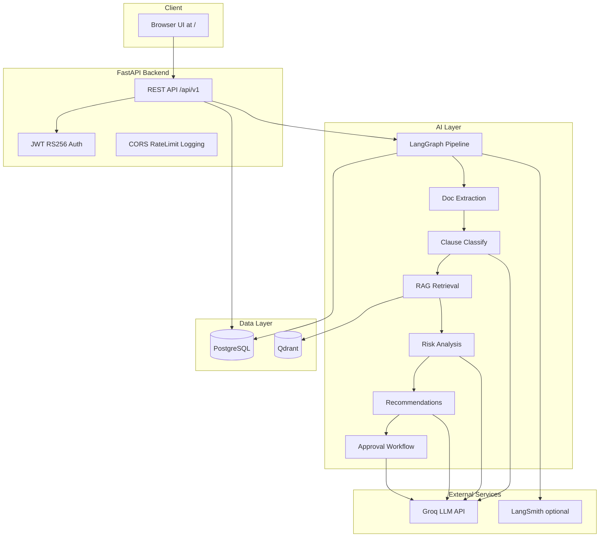

# Architecture

For full rationale behind technology choices (PostgreSQL, Qdrant, LangGraph, LangSmith, six agents), see **[Design Rationale](design-rationale.md)**.

## High-Level System View

```
┌─────────────────────────────────────────────────────────────┐
│                     LexAI Platform                          │
├───────────────┬─────────────────────┬───────────────────────┤
│  Frontend     │  FastAPI Backend     │  AI Agent Layer       │
│  HTML/CSS/JS  │  REST API            │  LangGraph Pipeline   │
│  (served /)   │  JWT + RBAC          │  6 Specialized Agents │
├───────────────┴─────────────────────┴───────────────────────┤
│               Data & AI Services                            │
│  PostgreSQL  │  Qdrant Vector DB  │  Groq API  │ LangSmith  │
└─────────────────────────────────────────────────────────────┘
```

## Component Diagram



## Request Lifecycle: Contract Upload

1. **Client** sends `POST /api/v1/contracts/upload` with multipart file + metadata.
2. **API** validates file type/size, computes SHA-256 hash, saves to `UPLOAD_DIR`, creates a `Contract` row with status `processing`.
3. **Background task** invokes the LangGraph pipeline with `contract_id`, `file_path`, and `contract_type`.
4. **Pipeline** runs six agents sequentially, accumulating state.
5. **Results** are persisted: `Clause` rows, risk scores, executive summary, optional `Approval` record.
6. **Contract status** updates to `reviewed`, `pending_approval`, or `error`.
7. **Audit logs** record each agent step with duration and token usage.

## Multi-Agent Pipeline

Defined in `backend/agents/pipeline.py`:

```
Document Upload
      │
      ▼
┌─────────────────┐
│ Agent 1:        │  PyMuPDF / python-docx
│ Doc Extraction  │  Chunk + tokenize
└────────┬────────┘
         ▼
┌─────────────────┐
│ Agent 2:        │  Groq LLaMA 3.1 70B
│ Clause Classify │  8 clause types
└────────┬────────┘
         ▼
┌─────────────────┐
│ Agent 3:        │  Qdrant ANN search
│ RAG Retrieval   │  SentenceTransformers
└────────┬────────┘
         ▼
┌─────────────────┐
│ Agent 4:        │  Risk score 0–100
│ Risk Analysis   │  4 risk levels
└────────┬────────┘
         ▼
┌─────────────────┐
│ Agent 5:        │  Clause rewrites
│ Recommendations │  Business impact
└────────┬────────┘
         │
    Risk Score > threshold?
       /        \
     Yes         No
      │           │
      ▼           ▼
┌──────────┐  ┌────────┐
│ Agent 6: │  │  Done  │
│ Approval │  │ Report │
└──────────┘  └────────┘
```

## LangGraph State

The pipeline uses a typed `PipelineState` (TypedDict) carrying:

- **Input:** `contract_id`, `file_path`, `contract_type`
- **Per-agent outputs:** raw text, chunks, classified clauses, RAG matches, risk results, recommendations
- **Workflow:** `requires_approval`, `executive_summary`, `routing_reason`
- **Meta:** `total_tokens`, `errors` (accumulated list)

## Key Design Decisions

| Decision | Rationale |
|----------|-----------|
| **Async SQLAlchemy + asyncpg** | Non-blocking DB I/O under concurrent API requests |
| **RS256 JWT** | Asymmetric signing; public key can be distributed to verifiers |
| **PostgreSQL for app state** | ACID, joins, RBAC, audit trail — see [Design Rationale](design-rationale.md#postgresql--why-a-relational-database) |
| **Qdrant for RAG** | ANN search over playbook clause embeddings with payload filters |
| **Local embeddings** | `all-MiniLM-L6-v2` — no API cost per search; 384-dim matches Qdrant |
| **Groq for LLM** | Low-latency inference for classification, risk, recommendations |
| **LangGraph** | Stateful, traceable multi-step agent orchestration |
| **Six specialized agents** | Mirrors legal workflow; per-step audit and token control — see [Design Rationale](design-rationale.md#six-agents--why-not-one-or-three) |
| **LangSmith (optional)** | LLM trace visibility in dev; not required for analysis to complete |
| **Monolithic FastAPI** | Simpler local dev; UI served from same process at `/` |
| **create_all on startup** | Tables auto-created via `init_db()` without Alembic wiring |

## Data Stores

| Store | Purpose | Key data |
|-------|---------|----------|
| **PostgreSQL** | Application state | Users, contracts, clauses, approvals, playbooks, audit logs |
| **Qdrant** | Vector search | Playbook clause embeddings (384-dim) |
| **File system** | Uploads | Original PDF/DOCX files in `UPLOAD_DIR` |

## Related Docs

- [Design Rationale](design-rationale.md) — why each technology was chosen
- [AI Agents](ai-agents.md) — per-agent detail
- [Database](database.md) — schema reference
- [RAG and Qdrant](rag-and-qdrant.md) — vector search setup
