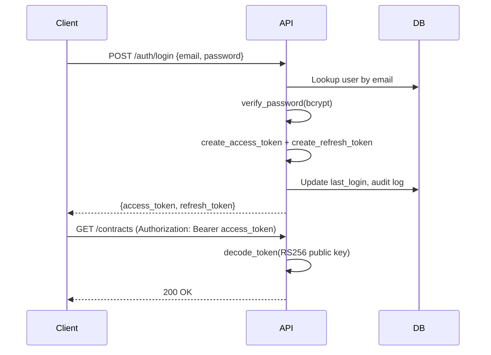

# Authentication

LexAI uses **JWT (JSON Web Tokens)** with **RS256** asymmetric signing, **bcrypt** password hashing, and **role-based access control (RBAC)**.

Implementation: `backend/auth/jwt_handler.py`

## Token Types

| Token | Lifetime | Purpose |
|-------|----------|---------|
| **Access token** | 60 minutes (configurable) | API authentication via `Authorization: Bearer` header |
| **Refresh token** | 7 days (configurable) | Obtain new access token without re-login |

## Login Flow



## Access Token Payload

```json
{
  "sub": "user-uuid",
  "role": "admin",
  "email": "admin@lexai.com",
  "type": "access",
  "jti": "unique-token-id",
  "iat": "issued-at",
  "exp": "expiration"
}
```

## Refresh Flow

```http
POST /api/v1/auth/refresh
Content-Type: application/json

{"refresh_token": "eyJ..."}
```

Returns a new access + refresh token pair. The refresh token must have `"type": "refresh"`.

## Password Hashing

Passwords are hashed with **bcrypt** (12 rounds) before storage. Plain passwords are never stored.

```python
hash_password(plain)   # → stored in users.password_hash
verify_password(plain, hashed)  # → bool
```

## Role-Based Access Control

Three roles defined in `UserRole` enum:

| Role | Guard dependency | Used for |
|------|------------------|----------|
| `admin` | `require_admin` | User management |
| `legal_manager` | `require_manager` | Approvals, playbook CRUD |
| `legal_reviewer` | `require_any_legal` | Contracts, analysis, dashboard |

### Role guards

```python
require_admin      # admin only
require_manager    # admin + legal_manager
require_any_legal  # admin + legal_manager + legal_reviewer
```

Endpoints inject these as FastAPI dependencies. A 403 is returned if the user's role is not permitted.

## JWT Key Setup

Generate RSA key pair (one-time):

```powershell
cd backend
mkdir keys
openssl genrsa -out keys/private.pem 2048
openssl rsa -in keys/private.pem -pubout -out keys/public.pem
```

Configure paths in `.env`:

```env
JWT_PRIVATE_KEY_PATH=./keys/private.pem
JWT_PUBLIC_KEY_PATH=./keys/public.pem
JWT_ALGORITHM=RS256
```

## Security Considerations

1. **Private key** must never be committed to git or shared publicly.
2. **Access tokens** should be stored securely on the client (the UI uses `localStorage`).
3. **Logout** currently writes an audit log entry; production deployments should add token blocklisting (e.g. Redis JTI store).
4. **HTTPS** is required in production to protect tokens in transit.

## Default Seed Accounts

Created by `python -m scripts.seed`:

| Email | Password | Role |
|-------|----------|------|
| admin@lexai.com | Admin@1234 | admin |
| manager@lexai.com | Admin@1234 | legal_manager |
| reviewer@lexai.com | Admin@1234 | legal_reviewer |

Change these passwords before any production deployment.

## Related Docs

- [API Reference](api-reference.md) — auth endpoints
- [Configuration](configuration.md) — JWT env vars
- [Seed Data](seed-data.md) — creating users
