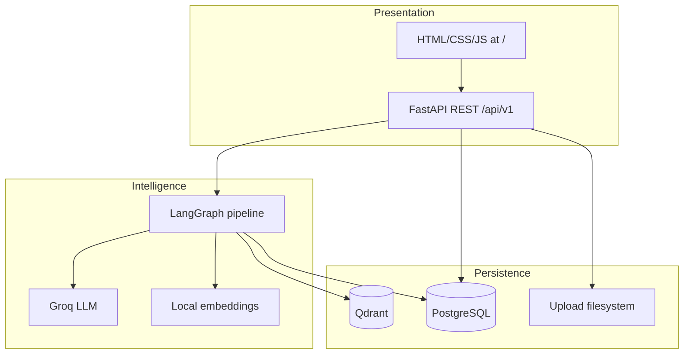
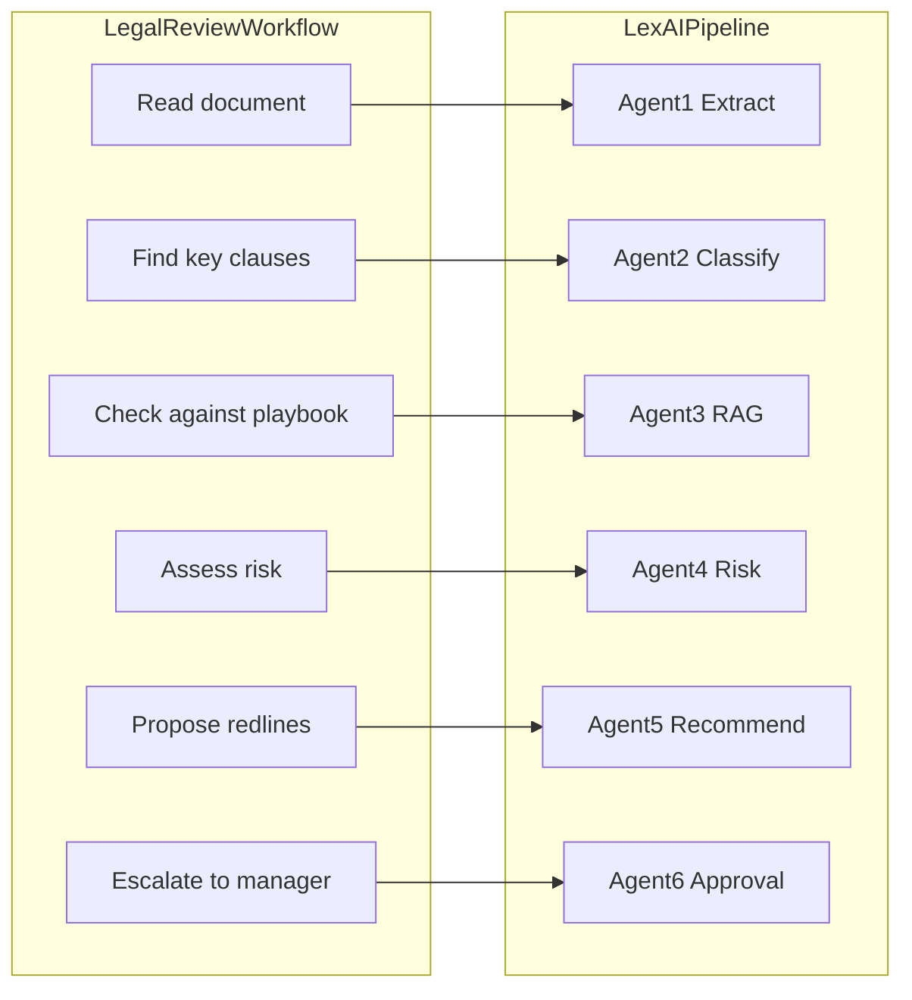

# Design Rationale

Why LexAI is built the way it is: technology choices, data architecture, and the six-agent pipeline.

For diagrams and request flow, see [Architecture](architecture.md). For version pins, see [Tech Stack](tech-stack.md).

## Architecture at a Glance

LexAI is organized in three layers:

| Layer | Technology | Role |
|-------|------------|------|
| UI + API | FastAPI monolith | Serve the web app, authenticate users, run analysis as background tasks |
| AI pipeline | LangGraph + Groq + embeddings | Multi-step contract analysis with shared state |
| Data | PostgreSQL + Qdrant + files | Relational app state, vector search, original uploads |

**Why a monolith for local dev:** One process serves the UI at `/`, the REST API, and background pipeline jobs. No separate frontend build or microservice orchestration for the MVP. Docker Compose can split frontend later — see [Deployment](deployment.md).

---

## PostgreSQL — Why a Relational Database

**What it stores:** Users, roles, contracts, clauses, approvals, playbook definitions (source text), and audit logs.

**Why PostgreSQL:**

- **ACID transactions** — contract upload, clause inserts, and approval updates must stay consistent.
- **Relational model** — foreign keys (`contract_id` → clauses, approvals), enums (`ContractStatus`, `RiskLevel`), and joins power the dashboard and API.
- **Mature ops** — familiar tooling (pgAdmin, backups, replication) for enterprise legal workflows.
- **Async access** — `asyncpg` + SQLAlchemy async keeps the API non-blocking under concurrent uploads.

**Why not put everything in Postgres?** Playbook *text* and workflow state belong in SQL. **Semantic similarity search** over embeddings is a different access pattern. At LexAI’s current scale you *could* use **pgvector** in the same database and drop Qdrant — that trades fewer services for mixing vector indexes with relational tables. Today the codebase keeps them separate; see [RAG and Qdrant](rag-and-qdrant.md).

Implementation: `backend/core/database.py`, `DATABASE_URL` in [Configuration](configuration.md).

---

## Qdrant — Why a Vector Database for RAG

**Problem:** Legal playbooks contain standard clause language. A contract clause may be worded differently but mean something similar. Keyword search misses paraphrases; **embeddings + nearest-neighbor search** find semantically close playbook text.

**What Qdrant does in LexAI:**

1. At seed time, playbook clauses are embedded and stored in collection `lexai_playbooks` (384 dimensions, cosine distance).
2. At analysis time, Agent 3 embeds each classified clause and searches for the closest playbook vectors (optionally filtered by `clause_type`).
3. Agent 4 compares contract text against the retrieved **standard_text** to score risk.

**Why a dedicated vector store (not only Postgres):**

- Purpose-built **approximate nearest neighbor (ANN)** indexes (HNSW).
- **Payload filters** — e.g. search only `liability` clauses.
- Small corpus today (~10–100s of vectors after seed), but the pattern scales as playbooks grow.

**Why Qdrant specifically:**

| Factor | Qdrant fit |
|--------|------------|
| Deployment | Local binary or Qdrant Cloud (free tier for dev) |
| Python SDK | `qdrant-client` — upsert, search, collection stats |
| RAG ecosystem | Common in LangChain tutorials and production examples |
| Open source | Self-host option without vendor lock-in |

Qdrant was chosen as a **practical default**, not because other vector DBs cannot work.

**Alternatives considered:**

| Alternative | Tradeoff |
|-------------|----------|
| **pgvector** (in existing Postgres) | Simpler ops (one DB); fine at LexAI scale; requires schema + client refactor |
| **Pinecone** | Fully managed, scales well; proprietary, often overkill for small playbook sets |
| **Chroma** | Very easy for prototypes; weaker production/cloud story than Qdrant Cloud |
| **Weaviate / Milvus** | Rich features; heavier setup and operations |
| **FAISS** (in-process) | No extra service; no shared multi-instance or cloud story |

**Swappable boundary:** `backend/rag/qdrant_client.py` — init, upsert, `search_similar_clauses`, stats.

---

## LangGraph — Why Graph Orchestration

**Problem:** Contract analysis is a **multi-step workflow** with intermediate artifacts (raw text → chunks → classified clauses → RAG matches → risk scores → recommendations → approval decision). It is not a single chat completion.

**What LangGraph provides:**

- A **compiled state graph** (`StateGraph` in `backend/agents/pipeline.py`) with explicit nodes and edges.
- **Shared state** — `PipelineState` TypedDict accumulates outputs from each agent.
- **Extensibility** — linear flow today; room to add branching, retries, or parallel nodes later without rewriting all agents.

**Why LangGraph vs a chain of plain async functions:**

- Clear **orchestration contract** — one place defines order: `extract → classify → rag_retrieve → risk_analyze → recommend → approval_workflow`.
- Fits the **LangChain / LangSmith** stack already used for prompts and tracing.
- Each node is independently testable and logged.

**Why not one mega-prompt to the LLM:**

| Stage | Tool | Why separate |
|-------|------|--------------|
| Parse PDF/DOCX | PyMuPDF, python-docx | Deterministic, no tokens |
| Classify clauses | Groq | Structured JSON extraction |
| Match playbooks | Embeddings + Qdrant | Retrieval, not generation |
| Score risk | Groq with RAG context | Needs retrieved standards first |
| Recommend rewrites | Groq | Only for elevated-risk clauses |
| Route approval | Groq + business rules | Human-in-the-loop threshold |

A single prompt would mix parsing, retrieval, and judgment; be harder to debug, audit, and optimize for token cost.

---

## LangSmith — Why Optional Observability

**What it does:** `@traceable` decorators on each agent and `run_contract_pipeline` send traces to LangSmith when configured. Contract and audit rows can store `langsmith_trace_id` for correlation.

**Required?** **No.** Analysis completes without `LANGSMITH_API_KEY`. Set `LANGSMITH_TRACING=false` in `.env` for fully local runs.

**Why use it at all:**

- **Per-LLM-call visibility** — prompts, responses, latency, token usage per agent.
- **Pipeline debugging** — see which agent failed or produced poor output without parsing server logs alone.
- **Team workflow** — share traces when tuning classification or risk prompts.

**Why not only application logs:** Structlog/uvicorn logs capture API events; LangSmith captures **LLM-specific** spans across the multi-agent graph. It is a development and quality tool, not on the critical path for production analysis.

Defaults: `LANGSMITH_TRACING=true`, `LANGSMITH_PROJECT=lexai-production` — see [Configuration](configuration.md).

---

## Groq and Local Embeddings — Why These Models

**Groq (LLaMA 3.1 70B Versatile)** — used by Agents 2, 4, 5, and 6:

- **Low latency** inference — important after upload when the user waits for analysis.
- **Cost-effective** for structured JSON tasks (classification, scoring) vs running a large model locally.
- Configured via `GROQ_API_KEY`, `GROQ_MODEL` in `backend/core/config.py`.

**sentence-transformers/all-MiniLM-L6-v2** — used for RAG embeddings:

- Runs **locally** — no per-search API cost.
- **384 dimensions** — matches `QDRANT_VECTOR_SIZE`.
- Same model at seed time and query time — required for meaningful similarity scores.

Agent 1 (document extraction) uses **no LLM** — only document parsers.

---

## Six Agents — Why Not One or Three

The pipeline mirrors how legal teams review contracts: extract text → identify clauses → compare to standards → assess risk → suggest edits → escalate if needed.

| Agent | Responsibility | Why separate |
|-------|----------------|--------------|
| **1 — Document extraction** | PDF/DOCX → text and chunks | Deterministic parsing; cheap and reliable without an LLM |
| **2 — Clause classification** | Detect clause types and boundaries | Structured LLM output (8 clause types); deduplication logic |
| **3 — RAG retrieval** | Ground each clause in playbook standards | Vector search is retrieval, not text generation |
| **4 — Risk analysis** | Per-clause and contract risk scores | Must run **after** RAG provides standard text to compare |
| **5 — Recommendations** | Suggested rewrites for risky clauses | Token-heavy; only needed for elevated risk |
| **6 — Approval workflow** | Executive summary + routing | Business rule (`RISK_APPROVAL_THRESHOLD`, default 80) + human-in-the-loop |

**Why not three agents (extract → analyze → report)?** Collapsing classification, RAG, risk, and recommendations loses per-step audit logs, makes failures harder to isolate, and forces one prompt to do retrieval and reasoning together.

**Why not more than six?** Additional splits (e.g. separate indemnification specialist) add orchestration cost without clear MVP benefit. Six steps match the product’s dashboard and API models.

Detail per agent: [AI Agents](ai-agents.md). Graph definition: `backend/agents/pipeline.py`.

---

## Other Stack Choices

| Choice | Rationale |
|--------|-----------|
| **FastAPI** | Async HTTP, automatic OpenAPI (`/docs`), Pydantic validation, `BackgroundTasks` for pipeline after upload |
| **JWT RS256 + RBAC** | Asymmetric signing; role guards (`admin`, `legal_manager`, `legal_reviewer`) on sensitive endpoints |
| **bcrypt passwords** | Industry-standard password hashing for seed and admin-created users |
| **Vanilla HTML UI** | No Node build step; single template at `backend/templates/contract-review-platform.html` |
| **Tailwind via CDN** | Rapid styling without a frontend toolchain |
| **PyMuPDF + python-docx** | Reliable PDF/DOCX text extraction for Agent 1 |
| **LangChain 0.3.x** | Current import style in agents; upgrade to 1.x deferred — see [Tech Stack](tech-stack.md) |

---

## What We Did Not Optimize For (MVP Scope)

These are intentional gaps, not oversights:

- **Multi-tenant isolation** — single-org demo model
- **Alembic migrations wired** — tables created via `init_db()` on startup; migration file exists but no `alembic.ini`
- **Playbook / user management UI** — API and seed scripts only
- **LangChain 1.x migration** — deferred to avoid breaking agent imports
- **Single-database pgvector** — Qdrant kept for clear RAG separation; consolidation possible later

---

## Related Docs

- [Architecture](architecture.md) — component diagrams and request lifecycle
- [AI Agents](ai-agents.md) — per-agent inputs, outputs, and files
- [RAG and Qdrant](rag-and-qdrant.md) — collection schema, seeding, search API
- [Database](database.md) — PostgreSQL tables and enums
- [Configuration](configuration.md) — environment variables for all services
- [Overview](overview.md) — product problem and user roles
