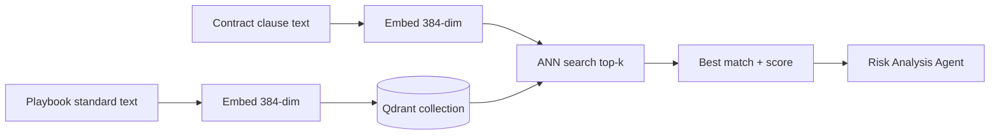

# RAG and Qdrant

LexAI uses **Retrieval-Augmented Generation (RAG)** to compare contract clauses against standard playbook language stored in **Qdrant**.

Implementation: `backend/rag/qdrant_client.py`, `backend/agents/rag_retrieval_agent.py`

## How RAG Works in LexAI

1. **Seed time:** Standard playbook clauses are embedded and stored in Qdrant.
2. **Analysis time:** Each classified clause from a contract is embedded with the same model.
3. **Search:** Qdrant finds the nearest playbook vectors (cosine similarity).
4. **Risk agent:** Compares contract clause text vs. the retrieved standard text.



## Qdrant Collection

| Setting | Value |
|---------|-------|
| Collection name | `lexai_playbooks` (configurable via `QDRANT_COLLECTION`) |
| Vector size | 384 |
| Distance metric | Cosine |
| Embedding model | `sentence-transformers/all-MiniLM-L6-v2` |

## Vector Payload Schema

Each point in Qdrant stores:

```json
{
  "clause_type": "liability",
  "playbook_id": "pb-nda-001",
  "playbook_clause_id": "nda-liability-1",
  "title": "NDA Standard — Mutual Liability Cap",
  "standard_text": "Neither party's aggregate liability...",
  "playbook": "NDA Standards",
  "contract_type": "NDA"
}
```

## Client Configuration

`get_qdrant_client()` in `qdrant_client.py` creates the client:

```python
kwargs = {"url": settings.QDRANT_URL}
if settings.QDRANT_API_KEY:
    kwargs["api_key"] = settings.QDRANT_API_KEY
return QdrantClient(**kwargs)
```

### Qdrant Cloud Setup

1. Create a free cluster at [cloud.qdrant.io](https://cloud.qdrant.io)
2. Copy cluster URL → `QDRANT_URL`
3. Create API key → `QDRANT_API_KEY`
4. Add both to `backend/.env`

### Local Qdrant

1. Download Qdrant binary from [qdrant.tech](https://qdrant.tech/documentation/guides/installation/)
2. Run `./qdrant` (listens on port 6333)
3. Set `QDRANT_URL=http://localhost:6333`, leave `QDRANT_API_KEY` empty

## Seeding Vectors

```powershell
# Full seed (includes Qdrant)
python -m scripts.seed

# Qdrant only
python -m scripts.seed_playbooks
```

**What gets seeded:**

| Playbook | Clauses |
|----------|---------|
| NDA Standards | 4 |
| MSA Standards | 4 |
| SLA Standards | 2 |

**Total:** 11 vectors

After upsert, `seed_playbooks_db.sync_vector_ids()` links Qdrant vector IDs back to `playbook_clauses` rows in PostgreSQL and sets `playbooks.qdrant_synced` / `last_synced_at`.

**Client version:** You may see a harmless warning if `qdrant-client` and Qdrant Cloud server versions differ. See [Troubleshooting](troubleshooting.md#qdrant-client-version-mismatch-warning).

## Search API

`search_similar_clauses(clause_text, clause_type, top_k=5)`:

- Embeds the input text
- Optionally filters by `clause_type`
- Returns hits with `id`, `score`, and full payload

Used by `RAGRetrievalAgent._search()`. Falls back to stub matches if Qdrant is down.

## Monitoring

Check collection stats via API:

```http
GET /api/v1/playbooks/qdrant/stats
Authorization: Bearer <token>
```

Response:

```json
{
  "vectors_count": 11,
  "indexed_vectors_count": 11,
  "status": "green"
}
```

## Stub Embeddings

If `sentence-transformers` is not installed, the system generates deterministic hash-based pseudo-vectors for development. These are not semantically meaningful — install the full dependency stack for real RAG.

## Related Docs

- [Seed Data](seed-data.md) — seed scripts
- [Configuration](configuration.md) — Qdrant env vars
- [AI Agents](ai-agents.md) — Agent 3 detail
- [Troubleshooting](troubleshooting.md) — Qdrant connection issues
